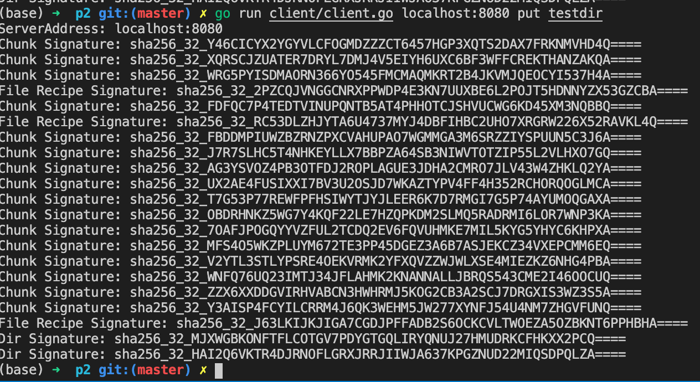
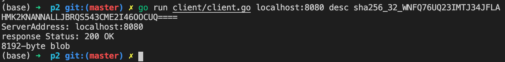

# Project 2

## Rabin-Karp Chunking
Before inserting two spaces:

After adding two spaces:

## Networking with http

put 
----
#### Putting a file to local server:
Recipes and blobs will be stored under `server_store` directory locally.

Client: The recipe for `testfile` is `sha256_32_BPL5QDZ5ABDB366ASD7XZ7IOYUUPBDJGDHYMCFEZSUNODYAWIQIA====`

Server: 

#### Putting a directory to local server:

Test directory structure:

Put result:

The recipe for `testdir` is `sha256_32_HAI2Q6VKTR4DJRNOFLGRXJRRJIIWJA637KPGZNUD22MIQSDPQLZA====`

get
----
#### Getting a blob from local server:
Pick a random blob `sha256_32_WNFQ76UQ23IMTJ34JFLAHMK2KNANNALLJBRQS543CME2I46OOCUQ====` and rename it to `datachunk`:

#### Getting a file from local server:
Use the recipe `sha256_32_BPL5QDZ5ABDB366ASD7XZ7IOYUUPBDJGDHYMCFEZSUNODYAWIQIA====` for `testfile` to reconstruct the file:

#### Getting a directory from local server:
Use the recipe `sha256_32_HAI2Q6VKTR4DJRNOFLGRXJRRJIIWJA637KPGZNUD22MIQSDPQLZA====` for `testdir` to reconstruct the directory:

#### Error Handling
Trying to `get` from a non-existing signature:

getfile
----

When running a `get` command on a file recipe signature, `get` will call `getfile` internally. So behaviors are the same for `get` and `getfile` when the signature file is a file recipe.

#### Getting a file from local server:
Use the recipe `sha256_32_BPL5QDZ5ABDB366ASD7XZ7IOYUUPBDJGDHYMCFEZSUNODYAWIQIA====` for `testfile` to reconstruct `newfile`:

#### Error Handling
Trying to use `getfile` on a non-existing signature:

Trying to use `getfile` on a directory recipe signature:

desc
----
#### `desc` on a file sig

#### `desc` on a directory sig

#### `desc` on a blob sig

## Remote server

`put` to and `get` from remote server:

`desc`:

## Extra credit
The `cats` directory contains cat images.

1. `put` the directory to the local server and get the signature for the directory recipe: `sha256_32_3DPW4JUKUHNW7FJI5JJAXCZRRC6OCZVXNKCHQ6PDR4FPK6SWHAVQ====`

2. Video demo:
https://youtu.be/TEJr83Gtn9E

 

