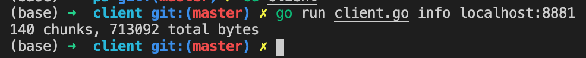

# Project 3

## Using SQLite

Now all reads are replaced with `db.Query` or `db.QueryRow`. All writes are replaced with SQL transactions. For example:

```go
ctx := context.Background()
tx, err := db.BeginTx(ctx, nil)
if err != nil {
	PrintExit("BeginTx error: %v\n", err)
}
_, err = tx.ExecContext(ctx, "INSERT INTO chunks (sig, data) VALUES (?, ?)", sig, msg.Data)
if err != nil {
	tx.Rollback()
	PrintExit("ExecContext error: %v\n", err)
}
err = tx.Commit()
if err != nil {
	PrintExit("Commit error: %v\n", err)
}
```

## Anti-Entropy and Merkle Trees

#### Tree construction
Merkle Trees are constructed recursively with the function:

```go
func buildTree(height int, pattern string, m map[string]TreeNode) *TreeNode 
```
**Return value:**

A TreeNode pointer.

**Argements:**

`height`: Height of the tree.

`pattern`: The prefix pattern that signatures tries to match in each node. 

`m`: A map that saves TreeNodes with corresponding signatures as their keys.

**Example:** 

To build a tree with height 3, call:

```go
buildTree(3, "", m)
``` 

Inside the function, 32 inner nodes are created by calling the line below in a for loop:

```go
buildTree(height-1, pattern+string(encodeStd[i]), m)
``` 

The recursive call reaches a leaf node when height is 1. Then it finds signatures that are allocated to its bucket with an SQL query: 

```go
db.Query("SELECT sig FROM chunks WHERE sig LIKE ? ORDER BY sig ASC", patternStr)
```

## Changes to Commands

The order of commands and addresses has swapped.

#### del & info

Server `localhost:8881` has 140 chunks in its database when starting:


When the client requests for server info it gets the same result:



The test below is doing the following:

1. Delete all data on `localhost:8881`
2. Requset for `localhost:8881`'s info
3. `put` sampledir to `localhost:8881`
4. `get` sampledir from `localhost:8881` and rename it to newir
5. Compare sampledir and newdir
6. Get `localhost:8881`'s database info, 138 chunks are on the server
7. Delete sampledir's recipe chunk in the server (with `last`)
8. Get `localhost:8881`'s info again, now it has 137 chunks


#### sync

The test below is doing the following:

1. Clean up everything on `8880` and put samplefile to it
2. Check `8880` and `8881`'s info
3. `sync` from both servers
4. Check their info again, number of chunks and bytes are identical


## Messaging

#### del (Version, Type, Sig) -> ()


#### info (Version, Type) -> (Info)


#### sync (Sig, TreeTarget, TreeHeight) -> (Info)


#### tree (Version, Type, TreeSig, Sig, TreeHeight) -> (TreeNode)


## Test Script

Below is my output from the test script:

```
0 chunks, 0 total bytes
0 chunks, 0 total bytes
sha256_32_HE6YYC6S2RWWTL4SJC6IM6NNL2L2P7CSTFJSWC4MF3ROCYNE7APQ====
sha256_32_ZQOJ5GSK3VRFX6NQGTW6LBGULGDW5XYRL2IV27JCCOAL3XPD7H3Q====
sync took 300 requests, 1190510 bytes, pulled 138 chunks
sync took 7 requests, 12026 bytes, pulled 2 chunks
sync took 1 requests, 2800 bytes, pulled 0 chunks
sync took 1 requests, 2800 bytes, pulled 0 chunks
Common subdirectories: xd/y and ../../p1/sampledir/y
sha256_32_HE6YYC6S2RWWTL4SJC6IM6NNL2L2P7CSTFJSWC4MF3ROCYNE7APQ====
sha256_32_ZQOJ5GSK3VRFX6NQGTW6LBGULGDW5XYRL2IV27JCCOAL3XPD7H3Q====
sync took 139 requests, 1017466 bytes, pulled 138 chunks
sync took 3 requests, 12708 bytes, pulled 2 chunks
sync took 1 requests, 10684 bytes, pulled 0 chunks
sync took 1 requests, 10684 bytes, pulled 0 chunks
```

## Extra Credit: Timeouts

I used this timeout handler function for both the client and the server to handle timeouts:

```go
func retryClient(req *http.Request, times int) (*http.Response, error) {
	var res *http.Response
	for i := 1; i <= times; i++ {
		client := &http.Client{Timeout: time.Duration((1+i)*TIMEOUT) * time.Millisecond}
		// fmt.Println("Retrying with deadline: ", TIMEOUT*(i+1))
		res, err = client.Do(req)
		if err == nil {
			break
		}
	}
	return res, err
}
```
`TIMEOUT` is an int representing the timeout deadline in milliseconds. The second argument `times` defines times to resend the request. For each resend, the timeout deadline will be extended by adding `TIMEOUT` ms to the previous one. For example, if `TIMEOUT` is set to 50, after the first request timeouts, the second deadline will be 50+50 = 100 ms. This process keeps going until the `time`-th try.
