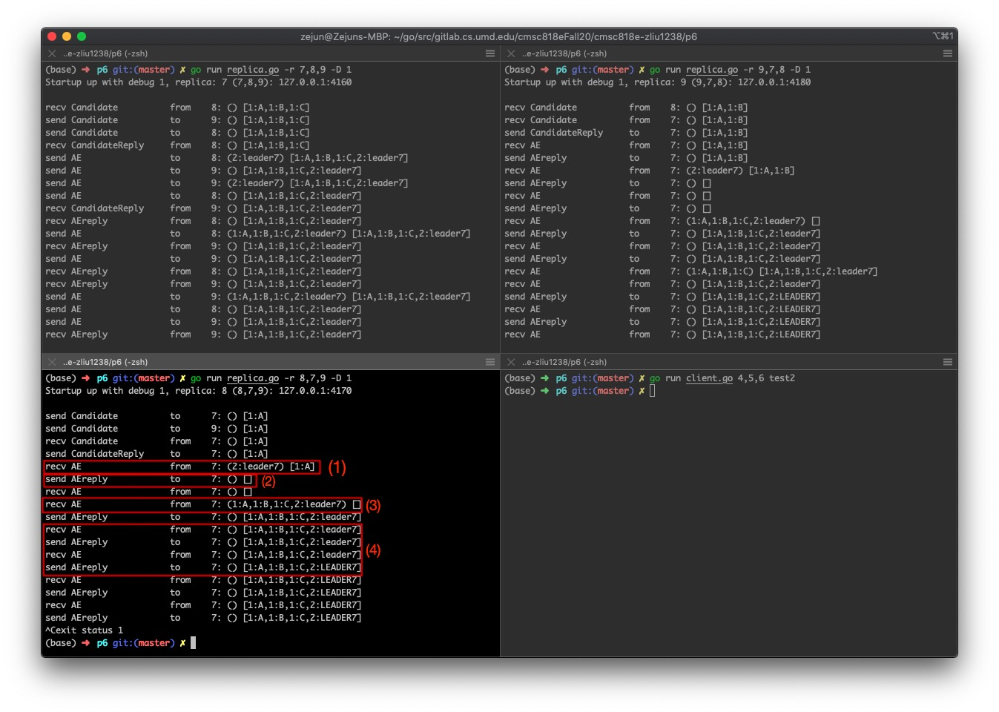

# Raft Report

## Current Status

The current version is ready for testing. There might be some bugs in it but when I ran the routines provided in the project description video, the results are eventually all as expected. However, the first few steps of log replication can remove more log entries than it needs to. It is because my implementation removes all log entries in a term that is not consistent with the leader. For example, in test 3, replica 8 has the record [1:A] in its term 1 but the leader replica 7 (if replica 7 wins the election) has [1:A, 1:B, 1:C]. My implementation removes all records in replica 8's term 1 and asks replica 7 to provide its version entries in term 1. 

Also, [2: leader7] cannot commit until the log recovery process is done. As a result, it will take more round trips until [2: leader7] is capitalized.

Below is an image showing this process:

(1) Replica 8 receives the "leader#' message along with a `CheckedEntry` from the leader, which asks replica 8 to check any inconsistencies within the requesting term. 

(2) Replica 8 rejects the "leader#" message because the consistency check is failed. It removes all log entries in term 1 and sends an AEreply message to the leader asking for another round of consistency check. In this example, it only needs one round to finish the check.

(3) The leader sends all needed log entries to replica 8. Replica 8 copies them to its local shared log.

(4) After the replication is done, the leader sends another commit request to commit "leader7". The entry is committed after 2 round trips.

## Client Handshaking

For every client command, I create a new HTTP server that listens to the client port in config.txt. The address is hardcoded in the variable `myAddr`. There is a channel variable `Committed` in `raft.go` which will block `MSG_COMMAND` from continuing until the leader commits the log entry. After the entry is committed, it replies back to the client and the client knows that the entry has been committed.

## Locks

For the leader, I lock the sharelog everytime it is read or written. 

For followers, I used several variables to indicate which phase the replica is at. `checkingConflict` means it is waiting for the leader to send the log entry for consistency check. `waitingForEntries` means it is during the log replication phase and is waiting for its missing entries from the leader. `committing` means it has noticed the leader that it can commit an entry and is waiting for the leader confirm the commit. `checkingConflict` and `waitingForEntries` will block commit requests from the leader.